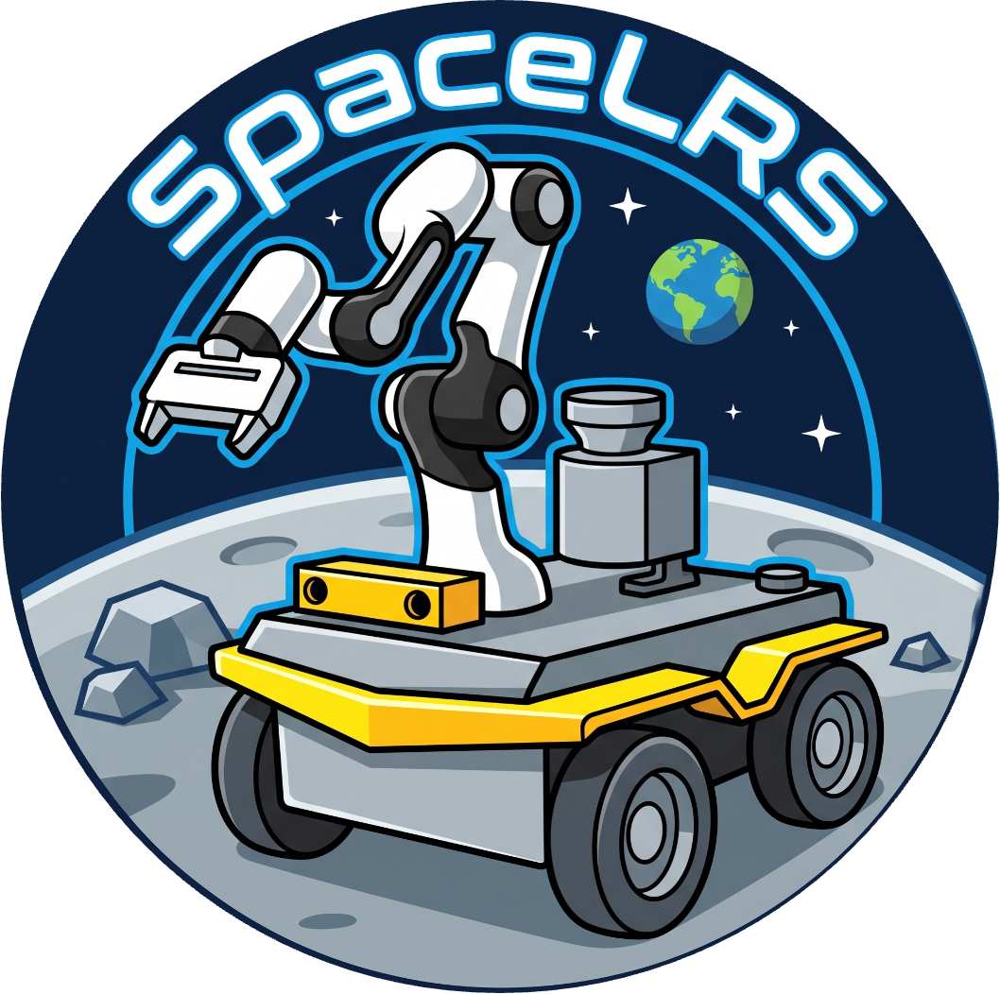

# Fallback-enabled VLM-guided embodied TAMP framework for planetary mobile manipulation
<center>

</center>

## 1. FEEA-Nav: Fallback-Enabled Embodied AI Navigation System for Lunar Sample Acquisition

[](https://opensource.org/licenses/BSD-3-Clause)
[](https://www.python.org/)
[](https://developer.nvidia.com/isaac-sim)

FEEA-Nav is a hierarchical, fault-tolerant Embodied AI visual servoing and navigation framework designed for space robotics manipulation tasks on challenging lunar terrains. By combining a Vision-Language Model (VLM) for semantic reasoning with a localized Open-Vocabulary Detector (DINO) for high-speed tracking, the system drives a mobile manipulator (Husky/Jackal base + UR3e arm) into the optimal workspace for rock sample collection inside lunar craters. 

The framework features an ultra-robust, physics-overriding **Quantum Pose-Locking Fallback Mechanism** to completely eliminate vehicle slippage/creep on steep crater slopes during manipulation handovers.

---

### 🚀 Key Features

* **Hierarchical Brain-Cerebellum Control**: Leverages a dual-agent system where a heavy VLM (Qwen Large Model) acts as the cognitive supervisor and a lightweight localized tracker (DINO) manages high-frequency visual servoing.
* **Dual-Loop EQA Referee Mechanism**: Implements a real-time validation pipeline. The VLM acts as an inspector, screening out false-positive detections caused by self-body reflections (e.g., the UR3e robotic arm) or sensory blind spots.
* **Hardware-Driven 3D Perception**: Integrates high-fidelity depth-sensing via an OmniVision OV9782 color camera pipeline and pseudo-depth buffers, stabilized with a $5 \times 5$ spatial median pooling filter to suppress edge jumps.
* **Anti-Slip Quantum Lock (God Mode)**: Overrides PhysX numerical truncation errors on slopes by executing frame-level world pose snapshot restoration, spatial velocity dampening, and custom `SuperFrictionMaterial` properties ($\mu = 1000.0$) at the contact dynamics layer.

---

### 🗺️ System Architecture & Finite State Machine (FSM)

The core control loop executes a 4-stage Finite State Machine to transition the vehicle safely from global exploration to absolute immobilization:

| State | Module in Charge | Objective | Exit Condition |
| :--- | :--- | :--- | :--- |
| `SEARCHING` | `VLMAgent` + DINO Server | Stationary global scanning and EQA target verification. | Target Confirmed by VLM Referee |
| `TRACKING` | `DinoTracker` + PID Loop | Localized high-speed tracking & continuous velocity alignment. | Target enters workspace ($0.65\text{m} < Z < 0.85\text{m}$) |
| `ARRIVED` | `Xforms Transform` | Absolute world coordinate calculation & hand-off memory snapshot. | Frame transformation complete |
| `DONE` | Quantum Memory Cache | Continuous frame-level state override to guarantee zero slope drift. | Arm model takes over control |

---

### 🛠️ Prerequisites & Installation

#### Environment Setup
This repository is built and tested on **NVIDIA Isaac Sim (4.5.0)** running on Ubuntu 20.04/22.04 LTS.

1. Install dependencies via the Isaac Sim bundled Python environment:
```bash
./python.sh -m pip install numpy scipy omegaconf hydra-core pillow requests

```


2. Ensure your local VLM/DINO serving stack is active at `http://127.0.0.1:8000`.
3. anygrasp
```bash

  conda activate ript_vla

  export LD_LIBRARY_PATH="/home/xunden/isaacsim/exts/isaacsim.ros2.bridge/humble/lib:${LD_LIBRARY_PATH}"

  python anygrasp_rpc_server.py

```


### 🧠 Technical Deep Dive & Methodology

FEEA-Nav completely abandons naive end-to-end visual servoing. Instead, it formalizes lunar navigation into a structured, peer-reviewed hierarchy comprised of three core advanced vision-language-action methodologies:

#### 1. Open-Vocabulary Proposal with Multimodal Verification
To bridge the distinct operational gaps between sparse symbolic instructions and dense geometric tracking, the system decouples spatial perception into an asynchronous dual-loop pipelining:
* **The Proposal Generation (Cerebellum Loop)**: A localized Open-Vocabulary Detector (DINO) executes at high frequency ($15\text{ Hz}$ skip-frame orchestration), continuously emitting bounding box proposals from raw pixel streams based on generalized semantic cues (e.g., `"the small rock."`).
* **The Cognitive Verification (Brain Loop)**: Rather than trusting single-shot proposals blindly, region-of-interest (ROI) bounding parameters are mapped onto the full-scale canvas and parsed into a high-capacity Multimodal Large Language Model (Qwen). The MLLM cross-examines the contextual presence of the crater and target geometries to validate semantic compliance before releasing joint control permissions.

#### 2. Visual-Prompted EQA Referee Mechanism
A persistent bottleneck in mobile manipulators is the "Self-Illusion Effect"—where the robot mistakes its own onboard effectors (e.g., the white link surfaces of the UR3e robotic arm) for ambient geological entities when moving into tight workspaces. 

FEEA-Nav introduces an explicit **Embodied Question Answering (EQA) Referee Loop**:
* The system dynamically intercepts localization states when depth constraints breach critical thresholds ($Z < 0.40\text{m}$).
* The candidate box is isolated, and the MLLM is prompted under a strict zero-shot penalty formulation to act as an independent quality inspector, evaluating the phrase: *"Is the object inside the marker an obstacle part of the robotic chassis/arm or the true target?"*
* If a self-body collision/hallucination is detected, the referee issues a systematic rejection token, instantly halting forward chassis momentum and reverting the control loop to a safe `SEARCHING` re-alignment phase.

### 3. Target-Focused Marker Prompting
Standard vision-language grounding often degrades in unstructured spatial environments like lunar yards due to excessive background clutter and low-contrast surface textures, leading to attention fragmentation in MLLM token layers. 

To concentrate cognitive resources, FEEA-Nav applies a pixel-level geometric visual prompt overlay:
<p align="center">
  
</p>
Where $\mathcal{M}$ represents an image-plane overlay function drawing high-contrast bounding indicators directly over the DINO proposal coordinates. This explicit visual marker anchors the MLLM's internal cross-attention maps onto the specific target quadrant, amplifying localized feature representations and eliminating semantic drift caused by surrounding crater shadows or unconstrained topographical variations.


### 💻 Usage

To launch the system orchestration on the 20-meter lunar yard asset environment, run:

```bash
./python.sh demo2.py environment=lunaryard_20m

```

#### Core Configuration Adjustments

System behaviors can be fine-tuned via Hydra configurations under `cfg/config.yaml`:

* `VISION_INTERVAL`: Frame skipping frequency for VLM/DINO evaluation loops (Default: `15`).
* `target_area`: Desired bounding box size defining the proximity threshold (Default: `15000`).


### 📄 License

This project is licensed under the BSD-3-Clause License - see the [LICENSE](https://www.google.com/search?q=LICENSE) file for details.


### 遥操作运行命令
```
~/isaacsim/python.sh run.py environment=lunaryard_20m
```
